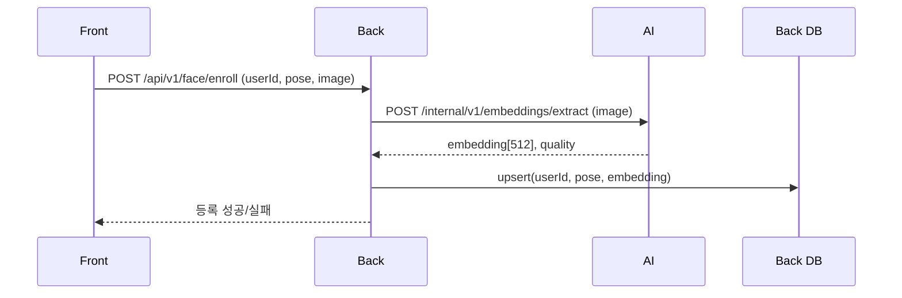
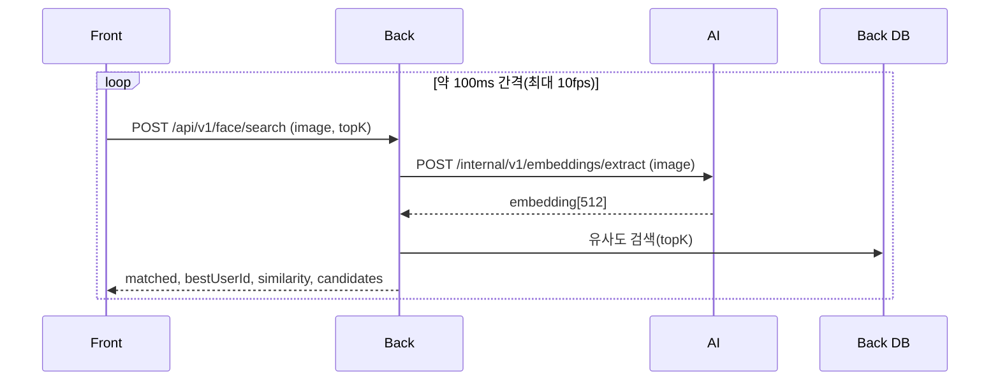

# 얼굴인식 분리 아키텍처 가이드 (Front-Back-AI)

## 1. 문서 목적
이 문서는 현재 얼굴인식 기능을 `AI 서버`와 `Back 서버`로 역할 분리할 때, 실제 구현에 필요한 전체 흐름과 코드 작성 기준을 정리한 문서다.

- 등록 플로우: 정면/상/하/좌/우 이미지 등록
- 검색 플로우: 실시간 촬영 프레임으로 사용자 식별
- 개인정보 원칙: 원본 이미지는 저장하지 않고, 임베딩(벡터)만 저장

## 2. 최종 권장 아키텍처
핵심 권장 경로는 아래와 같다.

`Front -> Back -> AI -> Back -> Front`

이 구조를 권장하는 이유:

- 인증/인가, 레이트 리밋, 감사 로그를 Back에서 일관 처리 가능
- AI 서버를 외부에 직접 노출하지 않아 보안 관리가 쉬움
- 개인정보 정책(원본 미저장)을 Back에서 강제하기 쉬움

## 3. 서비스별 책임 분리
| 영역 | 핵심 책임 | 저장 데이터 | 비고 |
|---|---|---|---|
| Front(Android) | 카메라 촬영, 사용자 안내, 서버 전송, 결과 표시 | 원본 영구 저장 없음(메모리 처리) | Passive liveness 1차 검증 가능 |
| Back(Spring) | 인증/인가, 업무 API, AI 호출, 임베딩 저장/검색, 최종 유저 매핑 | 임베딩, user_id, pose, audit log | 최종 판정 책임 |
| AI(FastAPI) | 이미지 -> 512 임베딩 벡터 추론 | 원본 저장 없음, 임시 메모리만 사용 | 모델 로딩/추론 전용 |

## 4. End-to-End 시퀀스
### 4.1 얼굴 등록 시퀀스 (정면/상/하/좌/우)


### 4.2 얼굴 검색 시퀀스 (실시간 프레임)


## 5. API 설계
### 5.1 Front -> Back 공개 API
### POST `/api/v1/face/enroll`
- 목적: 포즈별 얼굴 등록
- Content-Type: `multipart/form-data`

요청 필드:
- `userId`: string
- `pose`: `front|left|right|up|down`
- `image`: jpg/png 파일

응답 예시:
```json
{
  "success": true,
  "userId": "user123",
  "pose": "front",
  "savedAt": "2026-03-03T10:00:00Z"
}
```

### POST `/api/v1/face/search`
- 목적: 입력 얼굴을 기존 등록 얼굴과 비교해 최고 유사도 사용자 반환
- Content-Type: `multipart/form-data`

요청 필드:
- `image`: jpg/png 파일
- `topK`: number (기본 3)

응답 예시:
```json
{
  "matched": true,
  "bestUserId": "user123",
  "similarity": 0.81,
  "threshold": 0.7,
  "candidates": [
    {"userId": "user123", "pose": "front", "similarity": 0.81},
    {"userId": "user123", "pose": "left", "similarity": 0.79},
    {"userId": "user456", "pose": "front", "similarity": 0.62}
  ]
}
```

### GET `/api/v1/face/health`
- 목적: Back 얼굴인식 경로 상태 확인

### 5.2 Back -> AI 내부 API
### POST `/internal/v1/embeddings/extract`
- 목적: 이미지를 임베딩으로 변환
- 호출 주체: Back only
- 보호: 내부망 + 서비스 토큰(`X-Service-Token`) + mTLS 권장

요청:
- multipart: `image`

응답 예시:
```json
{
  "embedding": [0.0123, -0.031, 0.09, "..."],
  "dim": 512,
  "model": "arcface-buffalo_l",
  "faceCount": 1
}
```

오류 예시:
```json
{"code":"NO_FACE","message":"No face detected"}
```

### 5.3 오류 코드 표준(권장)
| Code | 의미 | HTTP |
|---|---|---|
| `EMPTY_IMAGE` | 파일이 비어 있음 | 400 |
| `INVALID_IMAGE` | 이미지 디코딩 실패 | 400 |
| `NO_FACE` | 얼굴 미검출 | 400 |
| `MULTIPLE_FACES` | 얼굴 2개 이상 | 400 |
| `AI_TIMEOUT` | AI 응답 지연 | 504 |
| `AI_UNAVAILABLE` | AI 서버 장애 | 503 |
| `UNAUTHORIZED` | 인증 실패 | 401 |

## 6. Back 데이터 모델
### 6.1 최소 테이블 설계
```sql
CREATE TABLE face_embeddings (
  id BIGSERIAL PRIMARY KEY,
  user_id VARCHAR(64) NOT NULL,
  pose VARCHAR(16) NOT NULL,
  embedding REAL[] NOT NULL,
  created_at TIMESTAMPTZ NOT NULL DEFAULT now(),
  updated_at TIMESTAMPTZ NOT NULL DEFAULT now(),
  UNIQUE(user_id, pose)
);
```

### 6.2 확장 권장 (pgvector)
대상 사용자가 많아지면 `REAL[]` 대신 `vector(512)` 권장.

```sql
CREATE EXTENSION IF NOT EXISTS vector;

CREATE TABLE face_embeddings (
  id BIGSERIAL PRIMARY KEY,
  user_id VARCHAR(64) NOT NULL,
  pose VARCHAR(16) NOT NULL,
  embedding vector(512) NOT NULL,
  created_at TIMESTAMPTZ NOT NULL DEFAULT now(),
  updated_at TIMESTAMPTZ NOT NULL DEFAULT now(),
  UNIQUE(user_id, pose)
);

CREATE INDEX idx_face_embeddings_hnsw
ON face_embeddings USING hnsw (embedding vector_cosine_ops);
```

## 7. Back 코드 작성 가이드 (Spring Boot 기준)
### 7.1 패키지 구조 예시
```text
backend/src/main/java/com/naeda/face/
  controller/FaceController.java
  service/FaceService.java
  client/AiClient.java
  dto/FaceDtos.java
  repository/FaceEmbeddingRepository.java
  entity/FaceEmbeddingEntity.java
  config/WebClientConfig.java
```

### 7.2 Controller 예시
```java
@RestController
@RequestMapping("/api/v1/face")
public class FaceController {
    private final FaceService faceService;

    @PostMapping(value = "/enroll", consumes = MediaType.MULTIPART_FORM_DATA_VALUE)
    public EnrollResponse enroll(
            @RequestPart("userId") String userId,
            @RequestPart("pose") String pose,
            @RequestPart("image") MultipartFile image) {
        return faceService.enroll(userId, pose, image);
    }

    @PostMapping(value = "/search", consumes = MediaType.MULTIPART_FORM_DATA_VALUE)
    public SearchResponse search(
            @RequestPart("image") MultipartFile image,
            @RequestPart(value = "topK", required = false) Integer topK) {
        return faceService.search(image, topK == null ? 3 : topK);
    }
}
```

### 7.3 Service 핵심 로직
- `enroll`: AI 임베딩 추출 -> DB upsert
- `search`: AI 임베딩 추출 -> 유사도 topK 조회 -> threshold(현재 0.7) 판정

```java
public SearchResponse search(MultipartFile image, int topK) {
    float[] probe = aiClient.extractEmbedding(image);
    List<Candidate> candidates = repository.findTopKByCosine(probe, topK);
    Candidate best = candidates.isEmpty() ? null : candidates.get(0);
    boolean matched = best != null && best.similarity() >= 0.7f;
    return SearchResponse.from(best, matched, 0.7f, candidates);
}
```

### 7.4 AI Client 연결 (WebClient/Feign)
```java
public float[] extractEmbedding(MultipartFile image) {
    // multipart로 AI 내부 API 호출
    // timeout, retry(짧게), circuit breaker 적용 권장
}
```

필수 설정:
- connect timeout/read timeout
- 5xx 재시도(짧게 1~2회)
- `X-Service-Token` 헤더
- 실패 시 명확한 도메인 예외 변환

## 8. AI 코드 작성 가이드 (FastAPI 기준)
### 8.1 역할
- 모델 로딩(ArcFace)
- 단일 얼굴 검증
- 임베딩 반환
- DB 접근 없음

### 8.2 엔드포인트 예시
```python
@router.post("/internal/v1/embeddings/extract")
async def extract(image: UploadFile = File(...)):
    embedding = await extract_embedding(image)  # len = 512
    return {
        "embedding": embedding,
        "dim": len(embedding),
        "model": "arcface-buffalo_l",
        "faceCount": 1
    }
```

검증 규칙:
- 빈 파일, 디코딩 실패, 얼굴 없음, 얼굴 다수 -> 400
- 임베딩 이상값 -> 500

### 8.3 성능 포인트
- 모델 로딩은 앱 시작 시 1회(`lru_cache`)
- 추론 서버는 stateless 유지
- 동시 요청 증가 시 워커 수평 확장

## 9. Front 코드 작성 가이드 (Android 기준)
### 9.1 이미지 수집
- CameraX `ImageAnalysis` 또는 `ImageCapture` 사용
- 서버 전송 전 JPEG 압축(예: quality 75~85)
- 해상도 과대 금지(예: 640~960px 급으로 시작)

### 9.2 10fps 처리 전략
무조건 1초 10장 전송보다, 아래 제어가 중요하다.

- 최소 전송 간격 100ms
- in-flight 요청 수 1~2개 제한
- 네트워크 지연 시 최신 프레임만 유지(drop old frame)

예시 로직:
```kotlin
if (now - lastSentAt < 100L) return
if (inFlight.get() >= 2) return
lastSentAt = now
sendFrameToBack(jpegBytes)
```

### 9.3 Retrofit API 예시
```kotlin
interface FaceApi {
    @Multipart
    @POST("/api/v1/face/enroll")
    suspend fun enroll(
        @Part("userId") userId: RequestBody,
        @Part("pose") pose: RequestBody,
        @Part image: MultipartBody.Part
    ): EnrollResponse

    @Multipart
    @POST("/api/v1/face/search")
    suspend fun search(
        @Part image: MultipartBody.Part,
        @Part("topK") topK: RequestBody
    ): SearchResponse
}
```

## 10. 개인정보/보안 체크리스트
- 원본 이미지 파일 저장 금지(Back/AI 모두)
- multipart 본문 로깅 금지
- HTTPS/TLS 적용
- 내부 API는 private network + service token
- 임베딩 테이블 최소 권한 접근(RBAC)
- 백업 암호화, 감사 로그 분리
- 임베딩 보존기간/삭제 정책 문서화

## 11. 운영 파라미터 권장값
- 임계값(threshold): `0.7`부터 시작 후 데이터로 재튜닝
- 검색 topK: 3~5
- Front 전송 fps: 최대 10, 기본 5부터 시작 권장
- AI timeout: 2~5초
- 이미지 크기: 200KB 내외 목표

## 12. 현재 코드 기준 마이그레이션 계획
현재 `AI`는 DB 저장/인식까지 포함하고 있다. 분리 시 아래 순서 추천.

1. AI 서버에 내부 임베딩 API 추가(`extract` 전용)
2. Back 서버에 등록/검색 API 신설
3. Back에서 DB 저장/유사도 계산 구현
4. Front의 호출 대상 `AI_BASE_URL` -> `BACK_BASE_URL` 변경
5. AI의 기존 공개 등록/검색 API는 점진 폐기

## 13. 최종 요약
- 네가 정리한 방향이 맞다: 등록/검색 모두 `Front -> Back -> AI -> Back -> Front`
- AI는 벡터화 전용, Back은 저장/검색/최종 판정 전용으로 분리
- 원본 이미지는 저장하지 않고 임베딩만 저장
- 임계값 0.7 기준으로 운영 시작 후 실제 데이터로 튜닝
